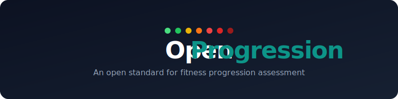

<p align="center">
  <a href="https://openprogression.org">
    
  </a>
</p>

<p align="center">
  <strong>7 levels. 8 categories. Research-backed benchmarks derived from over 1.3 million data points.</strong>
</p>

<p align="center">
  <a href="https://github.com/OpenProgression/openprogression/actions/workflows/ci.yml"></a>
  <a href="https://opensource.org/licenses/MIT"></a>
  <a href="https://openprogression.org"></a>
  <a href="https://github.com/OpenProgression/openprogression/issues"></a>
  <a href="https://github.com/OpenProgression/openprogression/pulls"></a>
</p>

---

## What is OpenProgression?

OpenProgression (OP) is a **free, open standard** for classifying athletic ability across functional fitness. It provides a common language for coaches, athletes, and software to describe fitness levels — from first-day beginner to elite competitor.

<table>
<tr>
<td>

**Open** — Free to use, implement, and contribute to

</td>
<td>

**Research-backed** — Every benchmark traces to peer-reviewed studies or public-domain data

</td>
</tr>
<tr>
<td>

**Gym-agnostic** — Works for any functional fitness facility, not tied to any brand

</td>
<td>

**Community-driven** — Standards improve through open contribution

</td>
</tr>
</table>

## [The 7 Levels](https://openprogression.org/levels)

<p align="center">
  
</p>

| Level | Name | Percentile | Description |
|:-----:|------|:----------:|-------------|
| 1 | **Beginner** | 0-20th | New to structured training |
| 2 | **Beginner+** | 20-35th | Fundamentals mastered, building consistency |
| 3 | **Intermediate** | 35-50th | Solid across all categories, handles moderate loads |
| 4 | **Intermediate+** | 50-65th | Competent athlete, proficient across all domains |
| 5 | **Advanced** | 65-80th | Strong and skilled, competition-capable |
| 6 | **Advanced+** | 80-95th | Competition-level fitness across all domains |
| 7 | **Rx** | 95-100th | Elite performance, top 5% of trained athletes |

> Levels are determined by the **weakest-link principle**: your overall level equals your lowest category level. This encourages well-rounded fitness rather than specialization.

### Foundation Milestones

For athletes below the Beginner benchmarks, **Foundation Milestones** provide early progress markers:

| Milestone | Name | Description |
|:---------:|------|-------------|
| F1 | **Foundation** | Basic human movements: chair sit-to-stand, wall push-up, walking |
| F2 | **Moving** | Bodyweight exercises: air squats, incline push-ups, plank holds |
| F3 | **Ready** | Ready for equipment: full push-up, dead hang, running a mile |

Foundation Milestones are not levels -- they are optional pre-level markers for applications that serve untrained or deconditioned populations. Full spec: [`spec/progressions.md`](spec/progressions.md)

## [The 8 Categories](https://openprogression.org/categories)

| Category | Key Movements |
|----------|--------------|
| **Squatting** | Back Squat, Front Squat, Overhead Squat |
| **Pulling** | Deadlift, Sumo Deadlift |
| **Pressing** | Strict Press, Push Press, Bench Press |
| **Olympic Lifting** | Clean, Snatch, Clean & Jerk |
| **Gymnastics** | Pull-ups, HSPU, Muscle-ups, Toes-to-Bar |
| **Monostructural** | 500m Row, 2000m Row, 1-Mile Run, 5K Run |
| **Bodyweight** | Push-ups, Pistols, Double-unders |
| **Endurance** | Fran, Grace, Murph, Cindy |

## Quick Example

Try it yourself with the **[Level Calculator](https://openprogression.org/calculator)**.

An 80kg male who can:

| Category | Result | Level |
|----------|--------|:-----:|
| Back Squat | 105kg | Intermediate+ |
| Deadlift | 150kg | Intermediate+ |
| Strict Press | 55kg | Intermediate+ |
| Clean & Jerk | 95kg | Intermediate+ |
| Strict Pull-ups | 9 reps | Intermediate+ |
| 2000m Row | 7:15 | Intermediate+ |
| Push-ups | 40 reps | Intermediate+ |
| Fran | 4:30 | Intermediate+ |

**Overall level: Intermediate+** — all categories at INT+ or above.

But if their pull-ups were only 4 (Intermediate), their overall level drops to **Intermediate** — the weakest link determines the chain.

## Repository Structure

```
openprogression/
├── spec/               # The standard (human-readable)
│   ├── levels.md
│   ├── categories.md
│   ├── methodology.md
│   └── progressions.md
├── data/               # Machine-readable benchmark data
│   ├── levels.json
│   ├── categories.json
│   ├── sources.json
│   ├── progressions.json
│   ├── milestones.json
│   └── benchmarks/
│       ├── squatting.json
│       ├── pulling.json
│       ├── pressing.json
│       ├── olympic_lifting.json
│       ├── gymnastics.json
│       ├── monostructural.json
│       ├── bodyweight.json
│       └── endurance.json
└── website/            # openprogression.org (Next.js)
```

## [Using the Data](https://openprogression.org/data)

All benchmark data is published as JSON and can be consumed by any application. Browse all benchmarks interactively at **[openprogression.org/benchmarks](https://openprogression.org/benchmarks)**.

```typescript
// Example: Load and use OP benchmarks
import squatting from '@openprogression/data/benchmarks/squatting.json'

function getLevel(movement: string, gender: 'male' | 'female', value: number) {
  const benchmark = squatting.benchmarks.find(b => b.movement === movement)
  if (!benchmark) return null

  const levelOrder = ['rx', 'advanced_plus', 'advanced', 'intermediate_plus',
                      'intermediate', 'beginner_plus', 'beginner']

  for (const level of levelOrder) {
    const standard = benchmark.standards[level][gender]
    if (value >= standard) return level
  }
  return 'beginner'
}

// A 80kg male with 105kg back squat
getLevel('back_squat', 'male', 105) // => 'intermediate_plus'
```

## Research Foundation

All benchmarks are derived from published, citable sources:

| Source | Type | Sample Size |
|--------|------|:-----------:|
| van den Hoek et al. (2024) | Peer-reviewed (J Sci Med Sport) | 809,986 |
| Mangine et al. (2023) | Peer-reviewed (Sports) | 569,607 |
| Concept2 Logbook Rankings | Public database | 10,000+ per distance |
| RunningLevel.com | Aggregated race data | 1,000,000+ |
| U.S. Military PFT Standards | Public domain (DoD) | Entire service branches |
| ACSM/Cooper Institute | Professional standard | Large-scale testing cohorts |
| Catalyst Athletics | Published standard | Competition data |
| StrengthLevel.com | Community database | 30,000-600,000+ per exercise |

Full source details with citations: [`data/sources.json`](data/sources.json) | [Methodology](https://openprogression.org/methodology): [`spec/methodology.md`](spec/methodology.md)

## For Coaches

OpenProgression gives you a shared framework to:

- **Assess** new members and place them in appropriate scaling with the [Level Calculator](https://openprogression.org/calculator)
- **Program** workouts scaled across all 7 levels with the [WOD Library](https://openprogression.org/programming)
- **Track** athlete progression over time with [objective benchmarks](https://openprogression.org/benchmarks)
- **Communicate** fitness levels in a way every coach understands

The weakest-link principle ensures athletes develop well-rounded fitness rather than hiding behind their strengths.

## For Developers

Build OP into your gym management software, workout tracking app, or coaching platform:

- [JSON data files](https://openprogression.org/data) ready to import
- Clear schema with TypeScript-friendly structure
- Gender-differentiated standards across [25 benchmarks](https://openprogression.org/benchmarks)
- Source citations for every benchmark
- [MIT licensed](https://openprogression.org/license) — use it however you want

## Contributing

We welcome contributions! See [CONTRIBUTING.md](CONTRIBUTING.md) for the full guide.

- **Review benchmarks** — Are the numbers accurate for your experience?
- **Add movements** — Help expand the movement library
- **Improve methodology** — Suggest better research sources
- **Build integrations** — Create packages for your language/framework

## Roadmap

- [x] **[Level Calculator](https://openprogression.org/calculator)** -- Instant level assessment across all 8 categories
- [x] **[Scaled Programming](https://openprogression.org/programming)** -- WOD library and daily sessions with 7-level scaling
- [x] **[Movement Progressions & Foundation Milestones](spec/progressions.md)** -- Regression chains and pre-Beginner progress markers for untrained populations
- [ ] **Age-adjusted benchmarks** -- Current standards target ~18-40 year-olds. Future versions may include age brackets.
- [ ] **Expanded bodyweight scaling** -- Enhanced BW-relative benchmarks beyond the current reference weights.
- [ ] **Additional movements** -- Expanding the movement library within existing categories.

## License

MIT License. See [LICENSE](LICENSE).

## Trademark

"OpenProgression", the OpenProgression logo, and the 7-level progression gradient mark are trademarks of the OpenProgression project. The trademarks are **not** licensed under the MIT license.

- **The standard, data, and code are fully open** — use them freely in any project, commercial or not
- **The name and logo require permission** for use on merchandise, commercial products, or anything that implies official endorsement

This is the same approach used by most major open source projects: the *work* is open, the *brand* is protected.

## Disclaimer

OpenProgression is an independent, community-driven open standard. It is not affiliated with, endorsed by, or derived from any commercial fitness assessment product. All benchmarks are independently derived from publicly available research and data sources cited in this repository.

---

<p align="center">
  <a href="https://openprogression.org"><strong>openprogression.org</strong></a> · <a href="https://openprogression.org/benchmarks">Benchmarks</a> · <a href="https://openprogression.org/calculator">Calculator</a> · <a href="https://openprogression.org/programming">Programming</a> · <a href="https://github.com/OpenProgression/openprogression">GitHub</a>
</p>
